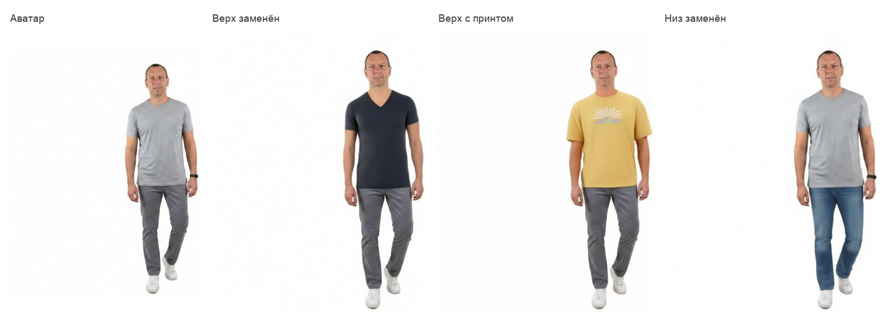
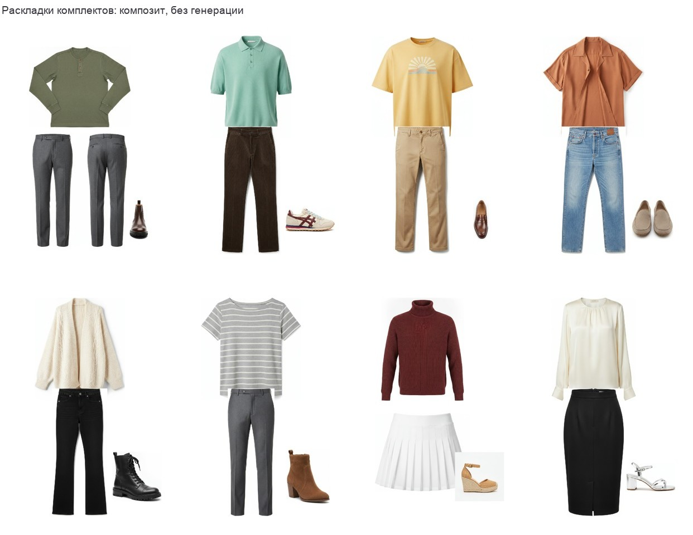
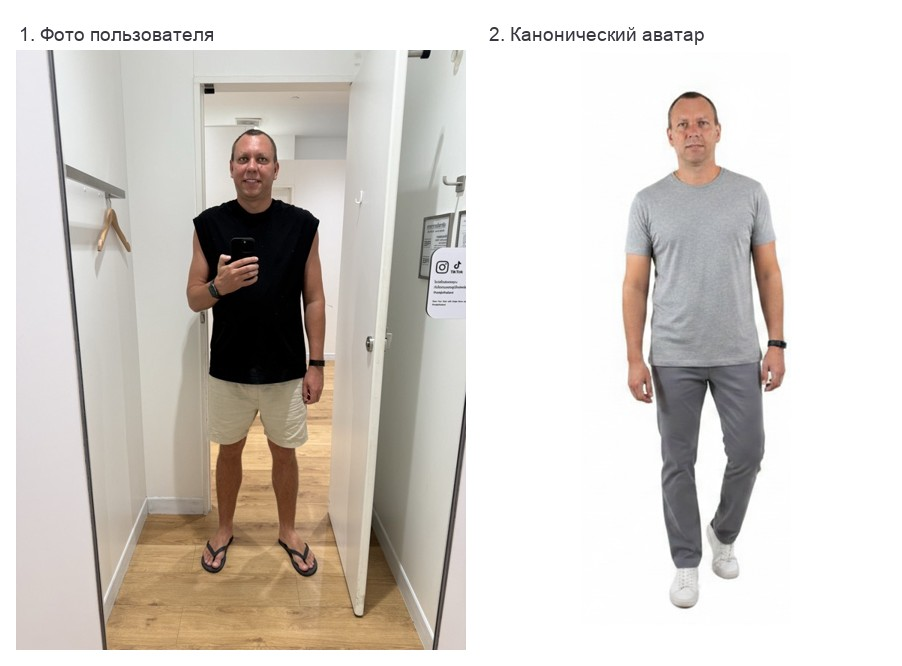
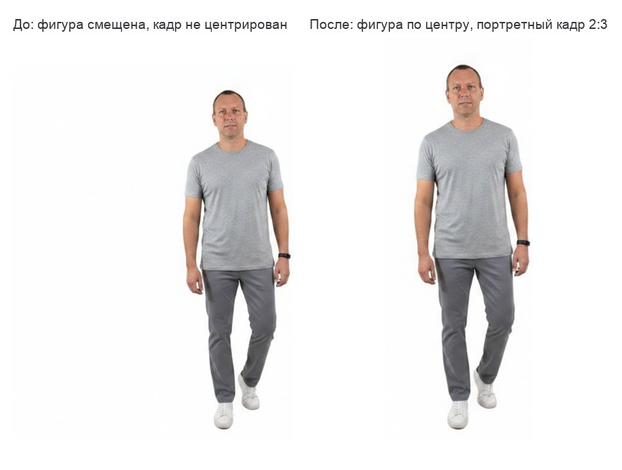
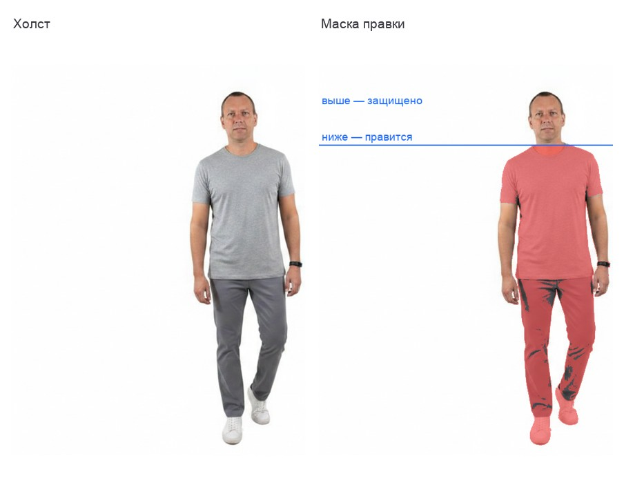
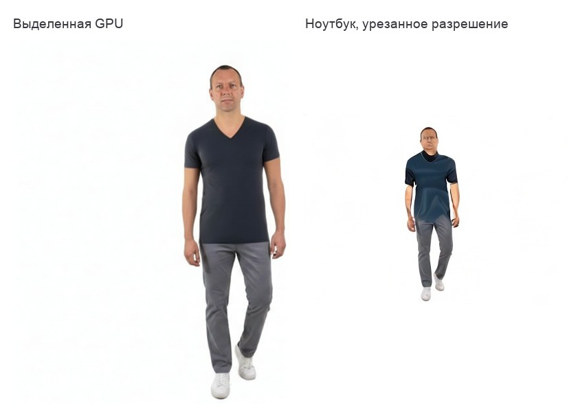

# Virtual Try-On Engine

Движок понимания и генерации образов на фотографии человека. Работает в
продакшене, замеры сняты 27–28.07.2026 на реализации Looktok.

Все иллюстрации ниже — реальные прогоны системы на одном и том же человеке,
не постановочные примеры.

---

## 1. Что умеет движок

Шесть возможностей. Каждая доступна отдельным вызовом, поэтому клиент может
взять только нужные.

### Анализ образа

По одной фотографии движок читает, что на человеке надето, и разбирает
сочетание. Возвращает оценку, вердикт одной фразой и замечания, привязанные к
координатам на снимке — интерфейс рисует их метками прямо поверх фото.

Отдельно определяется пол человека по фотографии. Дальше он работает жёстким
ограничением для всех предложений: ни одна вещь не может ему противоречить.

### Каталогизация по слотам

Движок раскладывает образ на слоты: верх, низ, обувь, верхняя одежда,
аксессуары. По каждому слоту говорит, что надето сейчас, и предлагает четыре
альтернативы с обоснованием и одной пометкой «рекомендую».

Каждое предложение привязывается к реальной вещи каталога через векторный
поиск. То есть это не текст, а артикул с фотографией, который можно надеть.

### Генерация образов

По поводу, телосложению, стилевому профилю и полу движок собирает готовые
комплекты. Работает в двух режимах: из каталога и из собственного гардероба
человека. Во втором случае слоты, которые гардероб не покрывает, сохраняются с
исходной фотографии, ничего не выдумывается.

### Изменение предложенного образа

Пользователь меняет отдельную вещь в комплекте и получает обновлённый рендер.
Отдельно есть проверка «а точно применилось» — движок сравнивает результат с
запросом и, если правка не сработала, повторяет её вместо показа неизменённой
картинки.

### Примерка на человеке

Человек видит себя в предложенной одежде, а не на манекене. Лицо, поза и фон
остаются его собственными.

Слева аватар, дальше три примерки: замена верха, верх с печатным рисунком,
замена низа. Поза, лицо и фон во всех кадрах те же.

Ключевое: **личность гарантирована конструкцией, а не просьбой к модели.**
Пиксели лица подставляются обратно из оригинала после генерации. Это снимает
целый класс дефектов, который иначе лечится повторами и заклинаниями в промпте.

### Профилирование

Тип фигуры, пропорции плеч к бёдрам и торса к ногам, обхваты диапазонами.
Считается один раз и дальше влияет на подбор кроя. Плюс стилевой профиль по
референсным фотографиям, которые загрузил сам пользователь.

---

## 2. Скорость

Текущие замеры и что их определяет.

| Операция | Сейчас | Что определяет |
|---|---|---|
| Анализ образа | 13 с на своих весах | размер модели, число зрительных токенов |
| Слоты и альтернативы | 20 с | объём ответа, до 40 предложений |
| Поиск по каталогу | доли секунды | векторный индекс |
| Плоские раскладки комплектов | **0.1 с** на комплект | только композит, модели нет |
| Примерка, 4 комплекта | 48 с | облачная генерация изображений |
| Повторный показ примерки | **1.5 с** | кэш, обращения к модели нет |
| Генерация набора под повод | 12 с план + 87 с рендер | планировщик плюс генерация |
| Проверка личности | 2.6 с | лёгкая модель сравнения |

### Что уже сделано для скорости

**Пакетирование.** Четыре комплекта рендерятся одним вызовом вместо четырёх:
человек и поза одинаковы, меняется только одежда. Это дало четырёхкратное
сокращение по числу вызовов при том же результате.

**Отказ от генерации там, где она не нужна.** Плоские раскладки комплектов
собираются композитом из готовых товарных фотографий за 0.1 секунды. Раньше их
рисовала модель за 28 секунд.

**Кэш как реестр.** Повторный показ того же комплекта на том же человеке
отдаётся за 1.5 секунды без обращения к модели.

**Ленивая генерация.** Просмотр комплектов не требует рендера. Примерка
запускается только когда пользователь её попросил.

### Потенциал собственного движка

Основную задержку сейчас создаёт облачная генерация изображений: десятки секунд
на вызов независимо от того, сколько комплектов в него упаковано. Это цена
универсальной модели, которая умеет всё, а не специализированной под примерку.

Собственный движок на выделенной карте сокращает это по трём направлениям:

**Специализированная архитектура.** Модель, обученная именно на примерке,
работает на порядок меньшем числе шагов, чем универсальный генератор
изображений.

**Дистилляция и уменьшение шагов.** Стандартный инференс это 30–50 шагов
диффузии. Дистиллированные варианты дают сопоставимый результат за 4–8 шагов.

**Отсутствие чужой очереди.** У облачных провайдеров замерена задержка от 56 до
374 секунд на одном и том же вызове — это ожидание в очереди, которым мы не
управляем. Своя карта убирает разброс.

Реалистичная цель для примерки на выделенной GPU — единицы секунд вместо
десятков. Слой понимания на той же карте перестаёт быть однопоточным и получает
батчинг.

Точка перехода определяется объёмом: пока запросов мало, аренда карты простаивает.

---

## 3. Технологии по слотам и альтернативы

Каждый слой изолирован интерфейсом, поэтому провайдер меняется переменной
окружения без пересборки. Разделение писалось после реального отказа: у одного
поставщика заблокировали платёжный аккаунт, и одновременно отвалились анализ,
слоты, проверка личности, построение аватаров и поиск по каталогу.

### Слот 1. Понимание образа (изображение → структурированный JSON)

| Вариант | Свойства | Когда выбирать |
|---|---|---|
| **Qwen3-VL 4B, локально (MLX)** — используем | Apache 2.0, свои веса, нет внешних запросов. Схему ответа не гарантирует, обслуживает один запрос за раз | своё железо, приватность данных |
| **OpenAI gpt-5.4-mini** — используем | strict JSON schema, форма ответа гарантирована принудительно | продакшен, где важна предсказуемость |
| **Gemini 2.5 Flash** — было основным | response schema, самый дешёвый на объёме, сильное зрение | объём при терпимости к вендор-локу |
| **Gemma 4 E4B / 12B, локально** | Apache 2.0, мультимодальна, читает изображение, видео и звук | замена Qwen, если нужна экосистема Google |
| Claude, Llama Vision | альтернативы того же класса | требование конкретного вендора |

Разница, которая влияет на объём кода: **гарантия формы ответа**. Strict-схема
даёт её принудительно. Схема ответа даёт слабее. Локальные веса не дают вообще,
поэтому нужен толерантный разбор JSON и принудительное приведение инвариантов.

Замечание про Gemma: она мультимодальна на входе, но генерирует только текст.
Заменить ею генерацию изображений нельзя.

### Слот 2. Векторный поиск по каталогу

| Вариант | Свойства |
|---|---|
| **OpenAI text-embedding-3-small @768** — используем | размерность задаётся параметром, поэтому колонки в базе не меняются при переходе |
| **Gemini embedding-001 @768** — было | сопоставимое качество |
| Локальные BGE / E5 / multilingual-e5 | свои веса, ноль внешних запросов, требует своего инференса |
| Cohere Embed | альтернатива того же класса |

Жёсткое эксплуатационное правило: **векторы разных моделей несравнимы**. Смена
провайдера требует переиндексации всего каталога, иначе поиск возвращает шум,
причём молча. По этой причине автоматический резерв для эмбеддингов отключён:
смешение векторных пространств портит выдачу тише, чем явная ошибка.

### Слот 3. Генерация примерки (человек + вещи → фотография)

Самый важный слот. Провайдеры различаются по трём свойствам, и ни один не даёт
всех трёх сразу.

| Провайдер | Привязка текста к областям | Вход маски | Точность вещи по референсу |
|---|---|---|---|
| **OpenAI gpt-image-1** — используем | да | да | хорошая |
| Gemini 2.5 Flash Image | да | нет | хорошая |
| FLUX.1 Fill (fal) | нет | да, на уровне сэмплера | только текст |
| Kolors Virtual Try-On (fal / Kling) | не требуется | не требуется | высокая, но наследует крой |
| CatVTON, IDM-VTON, Leffa (fal) | не требуется | да | высокая |
| Свои веса на арендованной GPU | по построению | да | зависит от обучения |

Что это означает практически:

- **Gemini** привязывает текст к квадрантам сетки идеально, но без входа маски
  подменяет человека обобщённой моделью. Проверено шестью независимыми
  попытками с разными формулировками, включая явные запреты.
- **FLUX Fill** сохраняет залоченные пиксели математически, лицо остаётся
  попиксельно тем же. Но не различает области изображения: один промпт
  размазывает один комплект на все четыре квадранта.
- **Kolors и модели класса CatVTON** специализированы под примерку и точно
  переносят вещь, но работают с одной вещью за вызов и не умеют обувь и
  аксессуары — обучены на верх, низ и платья.
- **OpenAI** единственный держит и привязку к областям, и маску, и референсы
  вещей одновременно. Личность у него мягкая, поэтому её доводит обратный
  композит.

Отдельно про лицензии: веса CatVTON и OOTDiffusion распространяются по
некоммерческой лицензии. Для платного продукта нужны либо свои веса той же
архитектуры, либо облачный провайдер.

### Слот 4. Плоские раскладки комплектов

| Вариант | Свойства |
|---|---|
| **Композит товарных фотографий** — используем | 0.1 с, вещи точны по определению, модели нет вообще |
| Любая генеративная модель | 28 с, и примерно один предмет из восьми теряется или дорисовывается |

Товарные фотографии каталога уже вырезаны на белом фоне, поэтому раскладка
собирается обрезкой полей, сортировкой по слоям и укладкой с перекрытием на
поясе. Генерация здесь добавляла только риск.

Восемь комплектов, собранных композитом: верхний ряд мужской, нижний женский.
Вещи в кадре — те же самые товарные фотографии, что лежат в каталоге.

### Слот 5. Инфраструктура

| Компонент | Используем | Альтернативы |
|---|---|---|
| База и векторный индекс | Postgres + pgvector | любой Postgres, Pinecone, Qdrant, Weaviate |
| Файлы | приватные бакеты объектного хранилища | S3, R2, GCS |
| Серверная логика | Edge Functions на Deno | любой serverless-рантайм, контейнеры |
| Реактивность | Realtime-подписки | WebSocket, SSE, long-polling |
| Обработка изображений | imagescript, чистый TypeScript | ImageMagick, sharp, PIL на своём сервисе |
| Клиент | Flutter, iOS | нативный, React Native, веб |

Ограничение, которое надо знать сразу: **серверная логика на serverless-рантайме
не может держать модель**. Там нет GPU и память в сотнях мегабайт. Модель живёт
либо в облаке провайдера, либо на отдельной машине с картой, а рантайм её
вызывает.

---

## 4. Как это собрано

Три слоя, каждый заменяем независимо.

**Понимание.** Мультимодальная модель отвечает на структурированные вопросы о
фотографии: анализ, слоты, профиль тела, распознавание вещи, проверка личности,
валидация результата.

**Композиция.** Из фотографии один раз строится канонический аватар — тот же
человек в нейтральной базовой одежде на белом фоне.

Исходный снимок сделан в примерочной, с наклоном и посторонним фоном. Аватар
нормализован: портретный кадр, ровная поза, чистый белый фон, нейтральная
базовая одежда. Дальше все примерки стартуют с него.

Нормализация кадра — не косметика. В сетке из четырёх ячеек смещённая фигура
даёт кривой коллаж, а маска строится относительно границ фигуры, поэтому ошибка
в них уводит зону правки на лицо.

Границы фигуры считаются по занятости строк и столбцов с требованием пяти подряд
занятых линий. Наивная проверка «любой не-белый пиксель» ломается на неидеально
белом студийном фоне: она объявляет фигурой весь кадр, и центрируется кадр, а не
человек. Все примерки стартуют с
него: личность проверяется один раз, собственная одежда не просачивается в
результат, входные байты стабильны, поэтому кэш детерминирован. Планировщик
собирает комплекты, векторный поиск привязывает их к артикулам.

**Рендеринг.** Коллаж два на два из одного аватара, маска по одежде, один вызов
модели, разрезание результата на четыре изображения. Затем обратный композит:
ответ модели накладывается на оригинал по маске, расширенной вниз и в стороны,
но никогда вверх к лицу. Лицо, кожа, волосы и фон берутся из оригинала.

Красным показана область, которую модели разрешено перерисовывать: одежда и
обувь. Голова, лицо, кисти и фон в маску не входят и берутся из оригинала.
Маска строится порогом по насыщенности, без нейросетевой сегментации, — это
работает потому, что базовая одежда аватара заведомо нейтральная.

Потолок сетки — четыре комплекта на вызов. На шести модель начинает дублировать
комплекты и рисовать номера панелей.

---

## 5. Варианты конфигурации

| Конфигурация | Понимание | Генерация | Когда |
|---|---|---|---|
| **Полностью облачная** | облачный провайдер | облачный провайдер | пилот, быстрый старт, нет инфраструктуры |
| **Гибрид** (измерен в кейсе) | свои веса локально | облачный провайдер | приватность анализа, скорость вывода на рынок |
| **Своя GPU** | свои веса на карте | свои веса на карте | объём, предсказуемая задержка, независимость |
| **Специализированный VTON** | любое | обученная под примерку модель на своей карте | целевая задержка в единицы секунд |

Переход между конфигурациями не требует переписывания: провайдер каждого слоя
задаётся переменной окружения.

---

## 6. Проверено и отклонено

| Подход | Почему не пошёл |
|---|---|
| 3D-аватар: параметрический манекен, одежда-оболочка, вьюер | далеко от фотореализма, отдельный конвейер на каждую вещь |
| 2.5D наклейки поверх фото с определением позы | не даёт правдоподобной посадки |
| Сетка с несколькими людьми без маски | модель заменяет человека обобщённой моделью |
| Локальная диффузия на ноутбуке | три точки отказа по памяти; в низком разрешении брак и замедление слоя понимания на том же GPU |
| Модель редактирования изображений 20B локально | не помещается, примерка без обучения провалилась |
| Генерация плоских раскладок моделью | композит точнее и в 280 раз быстрее |
| Специализированный VTON-провайдер как основной | разброс задержки от 56 до 374 секунд, нет обуви и аксессуаров |

Одна и та же модель на одном и том же человеке. Слева выделенная карта в родном
разрешении. Справа ноутбук с 16 ГБ, где родное разрешение не запускается и
приходится урезать: воротник превращается в чужую деталь, рукава сливаются с
руками, лицо теряется.

Главный вывод из сопоставления эталонов: одна модель привязывает текст к
областям изображения, но подменяет человека; другая сохраняет человека
математически, но не различает области. Рабочая схема берёт свойства обеих —
привязку к квадрантам от первой, гарантию личности от второй, но не маской в
сэмплере, а обратным композитом.
